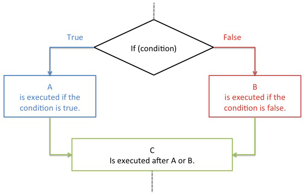
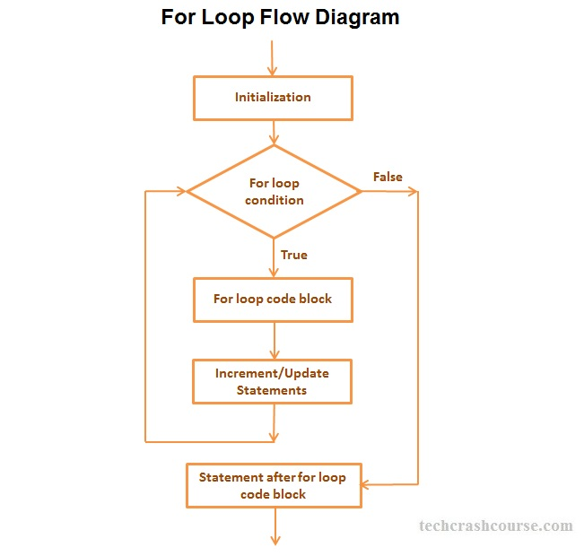

# VARIABLES, COMPARADORES, CONDICIONALES Y LOOPS

## VARIABLES
En JavaScript podemos declarar variables con `var`, `let` y `const`.
```javascript
var myName = 'Miguel';
let myAge = 36; //best choice!
const myHobby = 'climbing'; //only for somethig that not change.
```

### Tipos de variable:
```javascript
// String
let str = 'Hello World!';

// Number
let num = 8;

// Boolean
let bool1 = true;
let bool2 = false;

// Array
let arr = [true, 1, 'Hello'];

// Objects
let obj = {
    str = 'Miguel',
    num = 36,
    bool = false,
    arr = [24.04, 'amapola', true]
};
```

## COMPARADORES
```javascript
3 == '3' //true
3 === '3' //false
3 != true //true
3 !== '3' //true
3 < 5 //true
3 > 7 //false
3 >= 3 //true
3 <= 2 //false
```

## OPERADORES
```javascript
!true //false
!false //true
true && true //true
true && false //false
false && false //false
true || true //true
true || false //true
false || false //false
```

## CONDICIONALES

```javascript
// if
let num = 5;
if (num < 10) {
    console.log('Dinero insuficiente.');
}

// if-else
let user = 'Miguel';
if (user) {
    console.log('Hello ' + user + '!');
} else {
    console.log('Hello strange!');
}

// if-else if-else
let num = 50;
if (num < 20) {
    console.log('Small');
} else if (num < 100) {
    console.log('Medium');
} else {
    console.log('Large');
}

// Switch
let season = 'spring';
switch (season) {
    case 'summer':
        console.log('Very hot!');
        break;
    case 'winter':
        console.log('So cold!');
        break;
    case 'autumn':
        console.log('A lot of leaves!');
        break;
    case 'spring':
        console.log('Power flower!');
        break;
    default:
        console.log('Strange season');
}
```

## LOOPS

```javascript
// For
for (let i = 0; i < 10; i++){
    // Code here
}

// While
while (i < 10) {
    // Code here
}

// Do-while
do {
    // Code here
} while (i < 10)
```